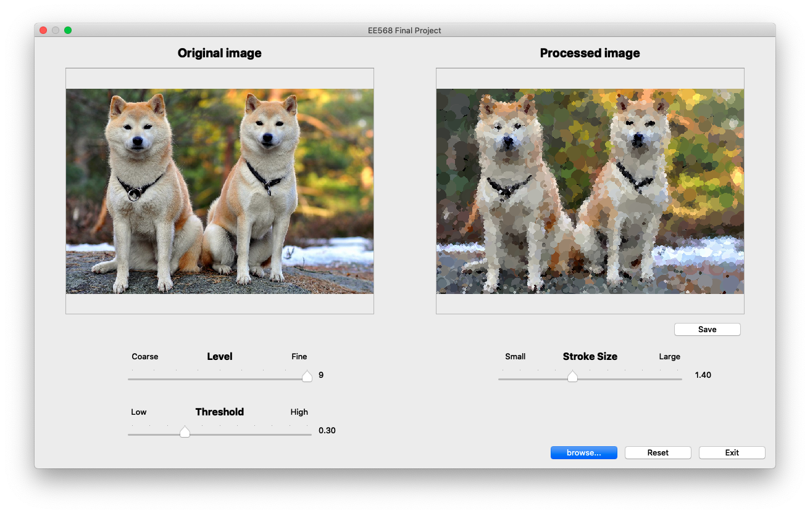

# Stroke-Based Image Artistic Stylization

## Introduction

It’a a stroke-based algorithm renders the given image applying the fundamental techniques of the impressionism. It uses short, thick strokes of paint to capture the essence of the object rather than the subject’s details. The output image is painted in a series of layers, starting from coarser layers to build the rough outlines with large strokes to finer layers to add details of objects with small strokes.

## Requirements

- Package Manager: conda (> 4.8.1)
- Tested OS: OS X-64 platform
- Input Format: BMP, JPEG and PNG files in RGB24 or grayscale

## Steps

First, navigate to the folder and download required packages using

```bash
$ conda create --name <env> --file requirements.txt
```

Next, activate the environment you just created.

```bash
$ conda activate <env>
```

Then, you should be able to execute and see the GUI by the folloing command:

```bash
$ python3 run.py
```

You have to first push “browse...” to load image. Those three scroll bars controls the variables mentioned in the previous section. You can use “Reset” button to reset all the scroll bars to default values or “Save” to save the output image. Press “Exit” to terminate the program.

## Demo

